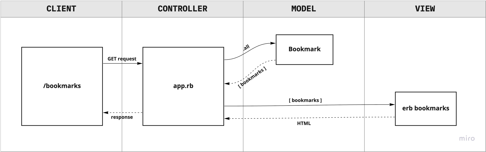

# Bookmark Manager

## User Stories
```
As a user
So that I can refer back to websites I regularly visit
I want to see a list of my bookmarks

As a user
So that I can save an interesting article I read online
I want to add a new bookmark

As a user
So I can only keep a list of websites that I want to refer back to
I want to delete old bookmarks

As a user
So that I can keep my list of bookmarks tidy
I want to update bookmarks

As a user
So that I can make notes on the bookmarks I saved
I want to comment on my bookmarks

As a user
So that I can organise my bookmarks
I want to tag bookmarks into categories

As a user
So that I can see my bookmarks based on a particular category
I want to filter bookmarks by their tag

As a user
So that others can't manipulate my list of bookmarks
I want my bookmarks to only be accessed by me
```

## Domain Model
